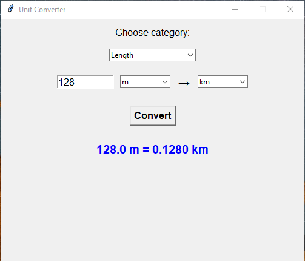

# Unit_Converter_Python_Tkinter
A simple Unit Converter application built with Python (Tkinter).

It allows users to convert between different measurement units in categories such as:

✅ Length (meters, kilometers, centimeters, millimeters)

✅ Mass (kilograms, grams, pounds, tons)

✅ Speed (m/s, km/h, mph)

✅ Time (seconds, minutes, hours)

✅ Temperature (Celsius, Fahrenheit, Kelvin)

Features:

User-friendly GUI built with Tkinter

Intro window with Start button

Drop-down menu for selecting categories

Supports multiple units per category

Handles temperature conversion separately (Celsius, Fahrenheit, Kelvin)

Cross-platform (Windows, Linux, MacOS)

Usage: python main.py

